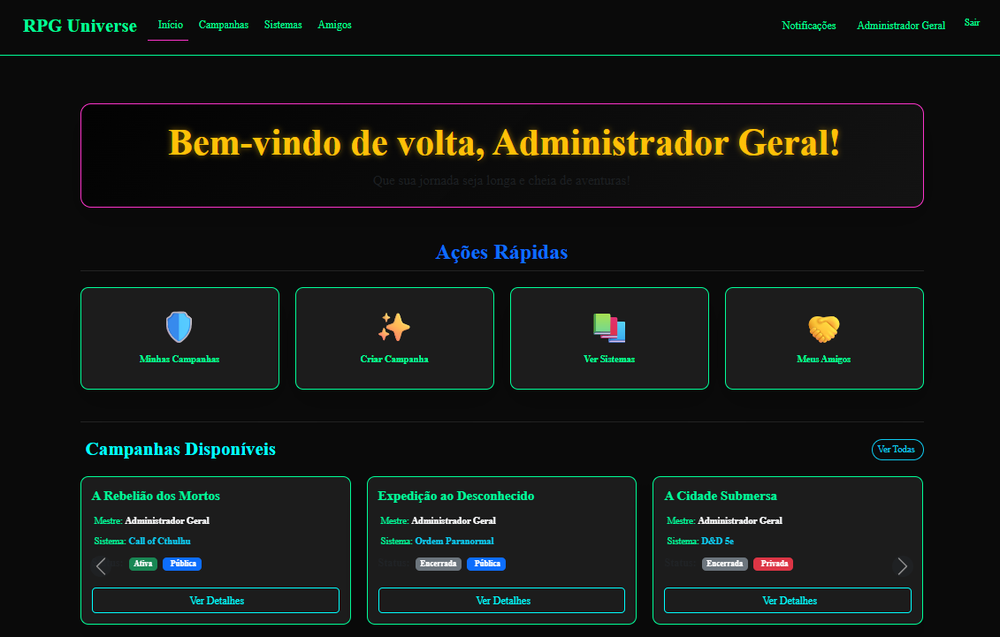
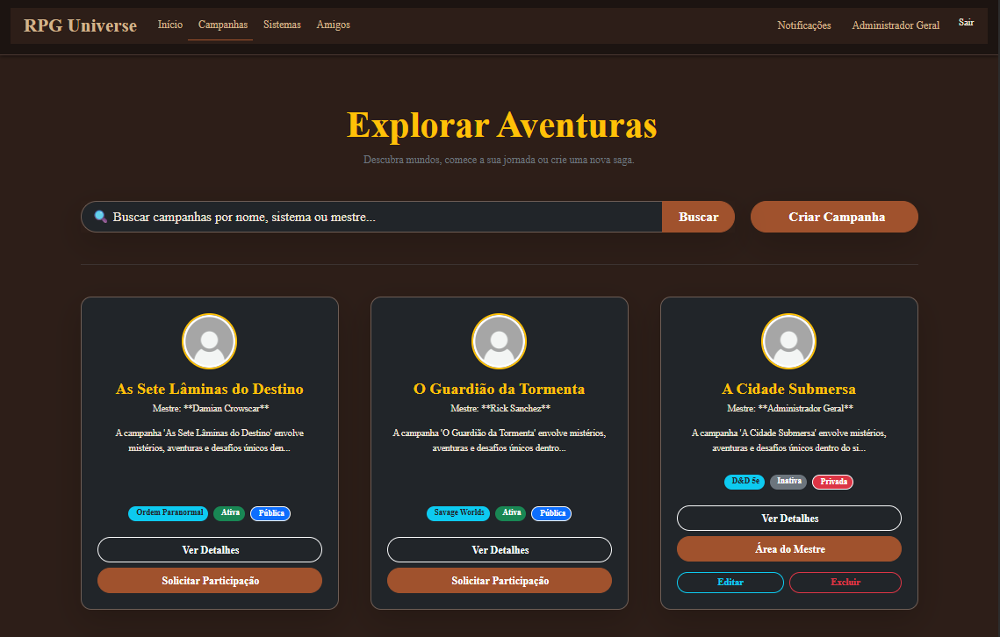
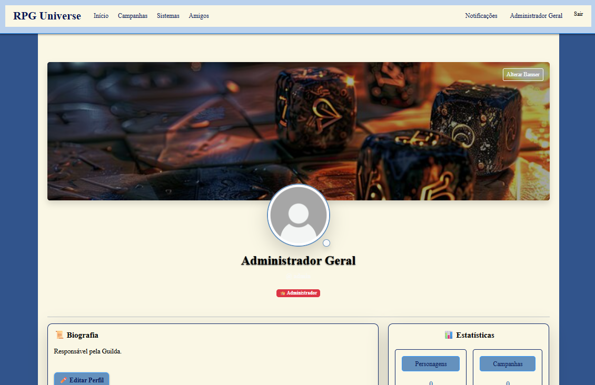
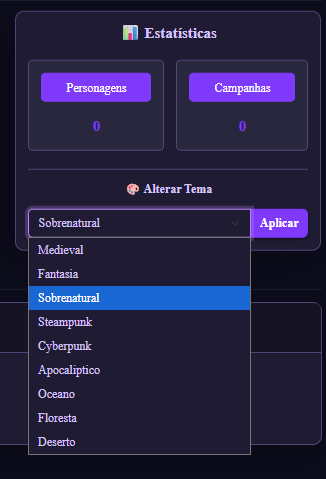
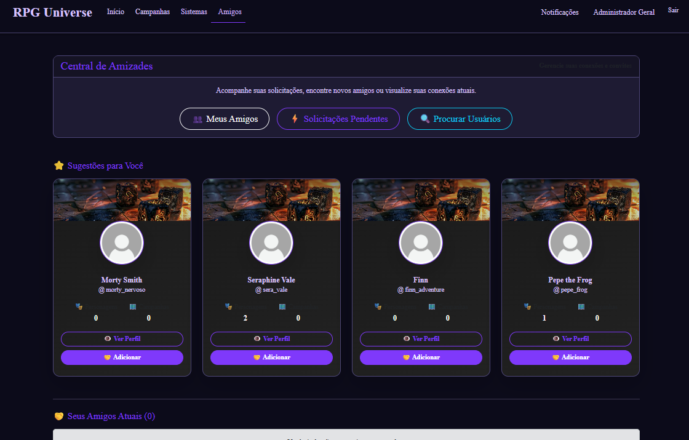

# 🎲 RPG Guilda — Gerenciador de Campanhas e Personagens

<p align="center">


</p>

---

# 📖 Sobre o Projeto

O **RPG Guilda** é uma plataforma desenvolvida em **Laravel 11** para gerenciamento de campanhas de RPG de mesa, permitindo que mestres e jogadores organizem campanhas, personagens, amizades e preferências de interface em um único ambiente.

O sistema oferece ferramentas para administração de campanhas, cadastro de personagens, gerenciamento de usuários e personalização da experiência através de um sistema de **temas**, permitindo que cada usuário escolha o estilo visual da aplicação conforme sua campanha ou preferência.

O projeto foi desenvolvido utilizando a arquitetura **MVC (Model-View-Controller)** do Laravel, aplicando conceitos de **Programação Orientada a Objetos**, **Eloquent ORM**, **autenticação**, **middleware**, **migrations**, **seeders**, **validação de formulários** e **relacionamentos entre tabelas**.

Para facilitar demonstrações e testes, o sistema conta com **seeders** responsáveis pela criação automática de usuários, campanhas, personagens e demais registros iniciais.

Este projeto foi desenvolvido como atividade da disciplina de **Desenvolvimento de Aplicações Web** do **Instituto Federal de Santa Catarina (IFSC) – Câmpus Chapecó**, com foco na aplicação prática dos recursos do framework Laravel.

---

# 🚀 Funcionalidades

## 👥 Usuários

- Cadastro de usuários
- Login e Logout
- Perfil do usuário
- Sistema de amizades
- Controle de permissões

---

## 🎲 Campanhas

- Cadastro de campanhas
- Organização por mestre
- Gerenciamento de participantes
- Informações da campanha

---

## 🧙 Personagens

- Cadastro de personagens
- Classes
- Raças
- Atributos
- Evolução dos personagens

---

## 🎨 Personalização

- Sistema de temas
- Alteração de cores da interface
- Personalização visual conforme o estilo da campanha
- Preferências salvas por usuário

---

## 📊 Administração

- Dashboard administrativo
- Gerenciamento de usuários
- Gerenciamento de campanhas
- Relatórios
- Estatísticas do sistema

---

## 🛠️ Recursos Técnicos

- Upload de imagens
- Middleware de autenticação
- Validação de formulários
- Sessões
- Mensagens Flash
- Eloquent ORM

---

# 🖼️ Telas do Sistema

## 🏠 Página Inicial

Tela inicial da plataforma.



---

## 🎲 Campanhas

Gerenciamento das campanhas cadastradas.



---

## 👤 Perfil do Usuário

Visualização e gerenciamento do perfil.



---

## 🎨 Sistema de Temas

Personalização visual da interface conforme o gosto do usuário.



---

## 🤝 Sistema de Amizades

Adição e gerenciamento de amigos.



---

# 🏗️ Arquitetura

```text
RPG-GERENCIADOR-LARAVEL
│
├── app
│   ├── Http
│   ├── Models
│   ├── Providers
│   └── Services
│
├── bootstrap
├── config
├── database
│   ├── migrations
│   ├── seeders
│   └── factories
├── public
├── resources
│   ├── css
│   ├── js
│   └── views
├── routes
├── storage
└── tests
```

---

# 🛠️ Tecnologias Utilizadas

## Backend

- PHP 8.2+
- Laravel 11
- Eloquent ORM
- MySQL

## Frontend

- Blade
- Bootstrap 5
- HTML5
- CSS3
- JavaScript

## Ferramentas

- Composer
- NPM
- Git
- GitHub
- Visual Studio Code

---

# 📂 Banco de Dados

O sistema utiliza **MySQL** como banco de dados relacional utilizando o **Eloquent ORM**.

### Principais Entidades

- Usuários
- Campanhas
- Personagens
- Classes
- Raças
- Itens
- Magias
- Temas
- Amizades

---

# 📊 Recursos do Laravel

- Arquitetura MVC
- Eloquent ORM
- Migrations
- Seeders
- Factories
- Middleware
- Authentication
- Validation
- Blade Templates
- Route Model Binding
- Sessions
- Storage Link

---

# 🚀 Como Executar

## Pré-requisitos

Instale:

- PHP 8.2+
- Composer
- Node.js
- MySQL
- Git

Recomendado:

- Laragon
- Laravel Herd

---

## 1️⃣ Clonar o projeto

```bash
git clone https://github.com/Ravemuon/rpg-gerenciador-laravel.git
```

```bash
cd RPG-GERENCIADOR-LARAVEL
```

---

## 2️⃣ Instalar dependências

```bash
composer install
```

```bash
npm install
```

---

## 3️⃣ Criar o arquivo .env

Linux

```bash
cp .env.example .env
```

Windows

```cmd
copy .env.example .env
```

---

## 4️⃣ Gerar chave

```bash
php artisan key:generate
```

---

## 5️⃣ Configurar banco

```env
DB_CONNECTION=mysql
DB_HOST=127.0.0.1
DB_PORT=3306
DB_DATABASE=rpg_guilda
DB_USERNAME=root
DB_PASSWORD=
```

Crie um banco chamado:

```
rpg_guilda
```

---

## 6️⃣ Executar

```bash
php artisan migrate:fresh --seed
```

```bash
php artisan storage:link
```

```bash
npm run dev
```

```bash
php artisan serve
```

---

# 💻 Executando com Laragon

1. Copie o projeto para a pasta **www** do Laragon.

2. Inicie Apache e MySQL.

3. Crie o banco **rpg_guilda**.

4. Execute:

```bash
composer install
npm install
php artisan key:generate
php artisan migrate:fresh --seed
php artisan storage:link
npm run dev
```

5. Abra:

```
http://rpg-gerenciador-laravel.test
```

(se o Virtual Host estiver habilitado)

---

# 🔑 Credenciais

## Administrador

| Campo | Valor |
|--------|-------|
| Email | admin@teste.com |
| Senha | admin123 |

## Jogador

| Campo | Valor |
|--------|-------|
| Email | jogador@teste.com |
| Senha | password |

---

# 📱 Responsividade

- Desktop
- Notebook
- Tablet
- Smartphone

---

# 🔒 Segurança

- Autenticação
- Middleware
- Proteção CSRF
- Hash de senhas
- Validação de formulários
- Controle de permissões
- Mass Assignment Protection

---

# 🎓 Disciplina

Projeto desenvolvido para a disciplina de **Desenvolvimento de Aplicações Web**.

**Instituto Federal de Santa Catarina (IFSC)**

**Câmpus Chapecó**

---

# 👨‍💻 Desenvolvedor

**Emilly Marteninghe Fortes (Ravemuon)**

GitHub:

https://github.com/Ravemuon

---

# 📄 Licença

Este projeto está licenciado sob a licença **MIT**.

---

## ⭐ Gostou do projeto?

Se este projeto foi útil ou interessante, considere deixar uma **⭐** no repositório.